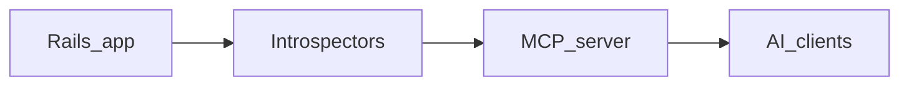

# rails-ai-bridge

> **Turn any Rails app into an AI-ready system — with real context, not guesswork.**

**One command. Zero config. Structured context + live introspection for AI assistants** via compact project files and an MCP server.

[](https://rubygems.org/gems/rails-ai-bridge)
[](https://github.com/igmarin/rails-ai-bridge/actions)
[](LICENSE)


---

## Why this matters

LLMs are powerful, but unreliable in real-world codebases without structure. They guess architecture, miss conventions, and waste tokens trying to understand your app.

rails-ai-bridge fixes this by giving AI assistants **explicit, structured knowledge of your Rails app upfront**, plus on-demand introspection when deeper detail is needed.

The result:
- More accurate code generation
- Faster time to first useful response
- Less token waste on exploration
- More predictable, production-ready outputs

This shifts AI from “helpful autocomplete” → **reliable engineering assistant**

## The problem

You open Claude Code, Cursor, or Codex and ask it to add a feature. It generates code that ignores your schema, your Devise setup, your existing enums, and the conventions already in your app.

**rails-ai-bridge fixes this permanently** by introspecting your Rails app and exposing that structure through compact, assistant-specific files plus a **live MCP server** with read-only `rails_*` tools ([Model Context Protocol](https://modelcontextprotocol.io)).

> **[Full Guide](docs/GUIDE.md)** — every command, option, and MCP parameter.

---

## How it works



1. **Up to 27 introspectors** in the `:full` preset scan schema, models, routes, controllers, jobs, gems, conventions, and more (`:standard` runs 9 core ones by default). Opt-in extras (e.g. `non_ar_models`, `database_stats`) are not in those presets.
2. **`rails ai:bridge`** writes bounded bridge files for Claude, Cursor, Copilot, Codex, Windsurf, Gemini, and JSON.
3. **`rails ai:serve`** exposes **11 built-in MCP tools** (plus any `additional_tools`) so assistants pull detail on demand (`detail: "summary"` first, then drill down).

### Folder guides

For contributors, key folders now include local `README.md` guides:

- [`lib/rails_ai_bridge/README.md`](lib/rails_ai_bridge/README.md)
- [`lib/rails_ai_bridge/introspectors/README.md`](lib/rails_ai_bridge/introspectors/README.md)
- [`lib/rails_ai_bridge/tools/README.md`](lib/rails_ai_bridge/tools/README.md)
- [`lib/rails_ai_bridge/serializers/README.md`](lib/rails_ai_bridge/serializers/README.md)
- [`lib/generators/rails_ai_bridge/README.md`](lib/generators/rails_ai_bridge/README.md)
- [`spec/lib/rails_ai_bridge/README.md`](spec/lib/rails_ai_bridge/README.md)

---

## Quick start

**From RubyGems** (once published):

```bash
bundle add rails-ai-bridge
rails generate rails_ai_bridge:install
```

**From GitHub** (before or alongside RubyGems):

```bash
bundle add rails-ai-bridge --github=igmarin/rails-ai-bridge
rails generate rails_ai_bridge:install
```

Or add to your `Gemfile`:

```ruby
gem "rails-ai-bridge", github: "igmarin/rails-ai-bridge"
```

Then `bundle install` and run the generator as above.

The install generator creates **`.mcp.json`** (MCP auto-discovery), sets up `config/initializers/rails_ai_bridge.rb`, and **interactively guides you through generating your first bridge files**.

### Install profiles

The generator prompts you to pick a profile (or pass `--profile` to skip the prompt):

| Profile | What it generates | Split rule dirs |
|---------|-------------------|-----------------|
| `custom` *(default)* | Per-format prompts — pick exactly what you need | Yes |
| `minimal` | Claude, Cursor, Windsurf, Copilot, Gemini shims | No |
| `full` | Every format | Yes |
| `mcp` | Only `.mcp.json` — generate files later with `rails ai:bridge` | — |

```bash
# Non-interactive — select profile upfront
rails generate rails_ai_bridge:install --profile=minimal

# CI/CD — skip file generation entirely
rails generate rails_ai_bridge:install --skip-context
rails ai:bridge   # generate later
```

Optional: `gem install rails-ai-bridge` installs the gem into your Ruby environment; you still add it to the app’s `Gemfile` for a Rails project.

### Verify the integration in *your* Rails app

1. **`bundle install` must finish cleanly** — until it does, `bundle exec rails -T` and `rails ai:serve` (from `.mcp.json`) cannot be verified. Merging this gem to `main` does not fix a broken or incomplete bundle on the host app.
2. **Regenerate in one shot** — run `rails ai:bridge` (not only a single format) so route/controller summaries stay consistent across `CLAUDE.md`, `.cursor/rules/`, and `.github/instructions/`.
3. **Keep team-specific rules** — generated files are snapshots. Use **`config/rails_ai_bridge/overrides.md`** for org-specific constraints (merged only after you **delete the first-line** `<!-- rails-ai-bridge:omit-merge -->` stub). Until then, the gem does not inject placeholder text into Copilot/Codex. See **`overrides.md.example`** for an outline. Alternatively re-merge into generated files after each `rails ai:bridge` (see `.codex/README.md`).
4. **Tune list sizes** — `RailsAiBridge.configure { |c| c.copilot_compact_model_list_limit = 5 }` (and `codex_compact_model_list_limit`); set `0` to list no model names and point only to MCP.
5. **Check your readiness** — `rails ai:doctor` prints a 0–100 score and flags anything missing after first install.

---

## Why rails-ai-bridge over alternatives?

| | **rails-ai-bridge** | **[rails-mcp-server](https://github.com/maquina-app/rails-mcp-server)** | **Manual context** |
| --- | --- | --- | --- |
| Zero config | Yes — Railtie + install generator | No — per-project `projects.yml` | No |
| Token optimization | Yes — compact files + `detail:"summary"` workflow | Varies | No |
| Codex-oriented repo files | Yes — `AGENTS.md`, `.codex/README.md` | No | DIY |
| Live MCP tools | Yes — 11 read-only `rails_*` tools (extensible) | Yes | No |
| Auto-introspection | Yes — up to **27** domains (`:full`) | No — server points at projects you configure | DIY |

*Comparison reflects typical documented setups; verify against each project before treating any row as absolute.*

---

## What Gets Generated

`rails ai:bridge` generates assistant-specific files tailored to each AI workflow:

```
your-rails-app/
│
├── 🟣 Claude Code
│   ├── CLAUDE.md                                         ≤150 lines (compact)
│   └── .claude/rules/
│       ├── rails-context.md                              semantic layer (compact: capped per tier + MCP hint)
│       ├── rails-schema.md                               table listing
│       ├── rails-models.md                               model listing (includes semantic tier)
│       └── rails-mcp-tools.md                            full tool reference
│
├── 🟡 OpenAI Codex
│   ├── AGENTS.md                                         project instructions for Codex
│   └── .codex/
│       └── README.md                                     local Codex setup notes
│
├── 🟢 Cursor
│   ├── .cursorrules                                      legacy compat
│   └── .cursor/rules/
│       ├── rails-engineering.mdc                         alwaysApply: true (rules first)
│       ├── rails-project.mdc                             alwaysApply: true
│       ├── rails-models.mdc                              globs: app/models/**
│       ├── rails-controllers.mdc                         globs: app/controllers/**
│       └── rails-mcp-tools.mdc                           alwaysApply: true
│
├── 🔵 Windsurf
│   ├── .windsurfrules                                    ≤5,800 chars (6K limit)
│   └── .windsurf/rules/
│       ├── rails-context.md                              project overview
│       └── rails-mcp-tools.md                            tool reference
│
├── 🟠 GitHub Copilot
│   ├── .github/copilot-instructions.md                   ≤500 lines (compact)
│   └── .github/instructions/
│       ├── rails-models.instructions.md                  applyTo: app/models/**
│       ├── rails-controllers.instructions.md             applyTo: app/controllers/**
│       └── rails-mcp-tools.instructions.md               applyTo: **/*
│
├── 🔴 Gemini
│   └── GEMINI.md                                         directive briefing + MCP guide
│
├── 📋 .ai-context.json                                   full JSON (programmatic)
└── .mcp.json                                             MCP auto-discovery
```

Each file respects the AI tool's format and size limits. **Commit these files** so the same project guidance is available to your whole team.

> Use `rails ai:bridge:full` to dump everything into the files (good for small apps <30 models).

---

## What Your AI Learns

| Category | What's introspected |
|----------|-------------------|
| **Database** | Every table, column, index, foreign key, and migration |
| **Models** | Associations, validations, scopes, enums, callbacks, concerns, macros (`has_secure_password`, `encrypts`, `normalizes`, etc.), **semantic tier** (`core_entity`, `pure_join`, `rich_join`, `supporting`) |
| **Non-AR Models** | Ruby classes under `app/models` that aren't ActiveRecord, tagged as `[POJO/Service]` (opt-in via `:non_ar_models` introspector) |
| **Routing** | Every route with HTTP verbs, paths, controller actions, API namespaces |
| **Controllers** | Actions, filters, strong params, concerns, API controllers |
| **Views** | Layouts, templates, partials, helpers, template engines, view components |
| **Frontend** | Stimulus controllers (targets, values, actions, outlets), Turbo Frames/Streams, model broadcasts |
| **Background** | ActiveJob classes, mailers, Action Cable channels |
| **Gems** | 70+ notable gems categorized (Devise = auth, Sidekiq = jobs, Pundit = authorization, etc.) |
| **Auth** | Devise modules, Pundit policies, CanCanCan, has_secure_password, CORS, CSP |
| **API** | Serializers, GraphQL, versioning, rate limiting, API-only mode |
| **Testing** | Framework, factories/fixtures, CI config, coverage, system tests |
| **Config** | Cache store, session store, middleware, initializers, timezone |
| **DevOps** | Puma, Procfile, Docker, deployment tools, asset pipeline |
| **Architecture** | Service objects, STI, polymorphism, state machines, multi-tenancy, engines |

The `:full` preset runs 27 introspectors. The `:standard` preset runs 9 core ones by default.

Start with `:standard` for most apps, then selectively enable additional introspectors (like `:non_ar_models` or `:database_stats`) as your use case requires.

This keeps context focused and avoids unnecessary token usage while still allowing deep introspection when needed.

---

## MCP Tools

The gem exposes **11 built-in tools** via MCP that AI clients call on-demand (hosts can append more via `config.additional_tools`):

| Tool | What it returns |
|------|----------------|
| `rails_get_schema` | Tables, columns, indexes, foreign keys |
| `rails_get_model_details` | Associations, validations, scopes, enums, callbacks, semantic tier, non-AR models (when enabled) |
| `rails_get_routes` | HTTP verbs, paths, controller actions |
| `rails_get_controllers` | Actions, filters, strong params, concerns |
| `rails_get_config` | Cache, session, timezone, middleware, initializers |
| `rails_get_test_info` | Test framework, factories, CI config, coverage |
| `rails_get_gems` | Notable gems categorized by function |
| `rails_get_conventions` | Architecture patterns, directory structure |
| `rails_search_code` | Ripgrep (or Ruby) search under `Rails.root` with allowlisted extensions, pattern size cap, and optional wall-clock timeout |
| `rails_get_view` | View layouts, templates, partials; optional per-file detail under `app/views` |
| `rails_get_stimulus` | Stimulus controllers: targets, values, actions, outlets (requires `:stimulus` introspector) |

All tools are **read-only** — they never modify your application or database.

### Smart Detail Levels

Schema, routes, models, and controllers tools support a `detail` parameter — critical for large apps:

| Level      | Returns                                | Default limit |
| ------------| ----------------------------------------| ---------------|
| `summary`  | Names + counts                         | 50            |
| `standard` | Names + key details *(default)*        | 15            |
| `full`     | Everything (indexes, FKs, constraints) | 5             |

```ruby
# Start broad
rails_get_schema(detail: "summary")           # → all tables with column counts

# Drill into specifics
rails_get_schema(table: "users")              # → full detail for one table

# Paginate large schemas
rails_get_schema(detail: "summary", limit: 20, offset: 40)

# Filter routes by controller
rails_get_routes(controller: "users")

# Get one model's full details
rails_get_model_details(model: "User")
```

A safety net (`max_tool_response_chars`, default 120K) truncates oversized responses with hints to use filters.

### Early real-world observations

Early project-level trials suggest the biggest improvement is not always dramatic token reduction by itself. In several runs, `rails-ai-bridge` led to faster, more focused responses even when total token usage only dropped modestly.

This is expected: compact assistant-specific files and the summary-first MCP workflow reduce orientation overhead, help the model navigate the codebase earlier, and improve the quality of the initial context.

Observed benefits so far:
- Less exploratory reading before the assistant reaches the relevant files
- Faster first useful response in Cursor and Windsurf trials
- Similar or slightly better answer quality with clearer project grounding
- More predictable drill-down via `detail:"summary"` first, then focused lookups

Results will vary by client, model, project size, and task type. More formal benchmarks are still in progress.

---

## MCP Server Setup

The install generator creates `.mcp.json` for MCP-capable clients. Claude Code and Cursor can auto-detect it, while Codex can use the generated `AGENTS.md` plus your local Codex configuration.

This project keeps [`server.json`](server.json) aligned with GitHub metadata for MCP registry packaging when you choose to publish a release artifact.

To start manually: `rails ai:serve`

<details>
<summary><strong>Claude Desktop setup</strong></summary>

Add to `~/Library/Application Support/Claude/claude_desktop_config.json` (macOS):

```json
{
  "mcpServers": {
    "rails-ai-bridge": {
      "command": "bundle",
      "args": ["exec", "rails", "ai:serve"],
      "cwd": "/path/to/your/rails/app"
    }
  }
}
```
</details>

<details>
<summary><strong>HTTP transport (for remote clients)</strong></summary>

```bash
rails ai:serve_http  # Starts at http://127.0.0.1:6029/mcp
```

Or auto-mount inside your Rails app:

```ruby
RailsAiBridge.configure do |config|
  config.auto_mount = true
  config.http_mcp_token = "generate-a-long-random-secret" # or ENV["RAILS_AI_BRIDGE_MCP_TOKEN"]
  # Production only: explicit opt-in + token required (see SECURITY.md)
  # config.allow_auto_mount_in_production = true
  config.http_path  = "/mcp"
  # Optional: reject HTTP requests when no Bearer/JWT/static auth is configured (safer beyond localhost)
  # config.mcp.require_http_auth = true
end
```

Clients must send `Authorization: Bearer <token>` when a token is configured.

Security note: keep the HTTP transport bound to `127.0.0.1` unless you add your own network and authentication controls. The tools are read-only, but they can still expose sensitive application structure. In **production**, `rails ai:serve_http` and `auto_mount` require a configured MCP token; `auto_mount` also requires `allow_auto_mount_in_production = true`. For operational hardening (tokens, proxies, `require_http_auth`, stdio threat model), see **[docs/mcp-security.md](docs/mcp-security.md)** and **[SECURITY.md](SECURITY.md)**.
</details>

---

## Codex Setup

Codex support is centered on **`AGENTS.md`** at the repository root.

- Run `rails ai:bridge:codex` to regenerate `AGENTS.md` and `.codex/README.md`.
- Keep `AGENTS.md` committed so Codex sees project-specific instructions.
- Keep personal preferences in `~/.codex/AGENTS.md`; use the repository `AGENTS.md` for shared guidance.
- When Codex is connected to the generated MCP server, prefer the `rails_*` tools and start with `detail:"summary"`.

---

## Best Practices

> See **[docs/BEST_PRACTICES.md](docs/BEST_PRACTICES.md)** for the full guide — including a client compatibility matrix, token optimization patterns, staleness management, and per-assistant workflow tips.

After testing with Cursor, Windsurf, Copilot, Codex, and Claude Code in real projects, these patterns consistently produce the best results.

### Layer 1: Commit your static files

The generated files (`.cursorrules`, `.cursor/rules/`, `AGENTS.md`, `.windsurfrules`, `CLAUDE.md`, `.github/copilot-instructions.md`) are loaded **passively** by AI tools on every session start — giving the assistant immediate project grounding before it reads a single line of your code.

**Always commit these files.** The whole team benefits, not just the developer who ran `rails ai:bridge`.

### Layer 2: Run the MCP server

Static files cover overview. The MCP server covers depth. When an assistant needs full schema details, specific model associations, or a filtered route listing, the `rails_*` tools fetch live data on demand — without inflating your initial context window.

The combination is additive:

| Setup | What you get |
|-------|-------------|
| Static files only | Passive overview: project structure always loaded |
| MCP server only | On-demand depth: accurate live data, no passive grounding |
| **Both (recommended)** | **Passive overview + on-demand depth = best coverage** |

This is the pattern that consistently outperforms either layer alone. The files reduce orientation overhead; the server handles the details when the assistant actually needs them.

### Keep files fresh — regenerate after every significant change

Static files are snapshots. An assistant working from a schema that is 20 commits out of date will still make assumptions based on the old structure. After any significant change — a new model, a migration, a refactor, a feature merged — run:

```bash
rails ai:bridge
```

**Rule of thumb:** treat `rails ai:bridge` the same way you treat `bundle install` after a `Gemfile` change — a routine step, not a one-time setup. Commit the regenerated files alongside the code change so the whole team stays in sync.

#### Auto-regeneration during active development

```bash
rails ai:watch
```

Watches for file changes and regenerates relevant context files automatically. Useful when you are actively adding models, routes, or controllers and want the assistant to track along in the same session.

### Use `detail: "summary"` first with the MCP server

When the MCP server is running, start broad and drill down:

```
1. rails_get_schema(detail: "summary")      → all tables, no noise
2. rails_get_schema(table: "orders")        → full detail for one table
3. rails_get_model_details(model: "Order")  → associations, validations, scopes
```

This keeps token usage low and answer quality high. Requesting full detail on every table at once is rarely necessary and wastes context on data the assistant does not need yet.

### Pick the right preset for your app

| Preset | Introspectors | Best for |
|--------|--------------|---------|
| `:standard` (default) | 9 core | Most apps — schema, models, routes, jobs, gems, conventions |
| `:full` | 27 | Full-stack apps where frontend, auth, API, and DevOps context matter |

Add individual introspectors on top of a preset for targeted additions:

```ruby
config.preset = :standard
config.introspectors += %i[non_ar_models views auth api]
```

### Check your readiness score

```bash
rails ai:doctor
```

Prints a 0–100 AI readiness score and flags anything missing: `.mcp.json`, generated context files, MCP token in production, and more. Run it after initial setup and after major configuration changes.

---

## Configuration

```ruby
# config/initializers/rails_ai_bridge.rb
RailsAiBridge.configure do |config|
  # Presets: :standard (9 introspectors, default) or :full (27). Add :non_ar_models etc. as needed.
  config.preset = :standard

  # Cherry-pick on top of a preset
  # config.introspectors += %i[non_ar_models views turbo auth api]

  # Context mode: :compact (≤150 lines, default) or :full (dump everything)
  # config.context_mode = :compact

  # Exclude models from introspection
  config.excluded_models += %w[AdminUser InternalAuditLog]

  # Tag primary domain models as core_entity (semantic context for AI + Claude rules)
  # config.core_models += %w[User Order Project]

  # Exclude paths from code search
  config.excluded_paths += %w[vendor/bundle]

  # Cache TTL for MCP tool responses (seconds)
  config.cache_ttl = 30
end
```

<details>
<summary><strong>All configuration options</strong></summary>

| Option | Default | Description |
|--------|---------|-------------|
| `preset` | `:standard` | Introspector preset (`:standard` or `:full`) |
| `introspectors` | 9 core | Array of introspector symbols |
| `context_mode` | `:compact` | `:compact` (≤150 lines) or `:full` (dump everything) |
| `claude_max_lines` | `150` | Max lines for CLAUDE.md in compact mode |
| `max_tool_response_chars` | `120_000` | Safety cap for MCP tool responses |
| `excluded_models` | internal Rails models | Models to skip during introspection |
| `core_models` | `[]` | Model names tagged as `core_entity` in introspection and `.claude/rules/` |
| `excluded_paths` | `node_modules tmp log vendor .git` | Paths excluded from code search |
| `auto_mount` | `false` | Auto-mount HTTP MCP endpoint |
| `allow_auto_mount_in_production` | `false` | Allow `auto_mount` in production (requires MCP token) |
| `http_mcp_token` | `nil` | Bearer token for HTTP MCP; `ENV["RAILS_AI_BRIDGE_MCP_TOKEN"]` overrides when set |
| `search_code_allowed_file_types` | `[]` | Extra extensions allowed for `rails_search_code` `file_type` |
| `search_code_pattern_max_bytes` | `2048` | Maximum `pattern` size (bytes) for `rails_search_code` |
| `search_code_timeout_seconds` | `5.0` | Wall-clock limit per search (`0` disables); mitigates runaway regex / CPU |
| `require_http_auth` | `false` | When `true`, HTTP MCP returns `401` if no Bearer/JWT/static auth is configured |
| `rate_limit_max_requests` | `nil` (profile default) | Per-IP sliding window ceiling (`0` disables); not shared across workers |
| `rate_limit_window_seconds` | `60` | Sliding window length for HTTP rate limiting |
| `http_log_json` | `false` | One JSON log line per HTTP MCP response when enabled |
| `expose_credentials_key_names` | `false` | Include `credentials_keys` in config introspection / `rails://config` |
| `additional_introspectors` | `{}` | Optional custom introspector classes keyed by symbol |
| `additional_tools` | `[]` | Optional MCP tool classes appended to the built-in toolset |
| `additional_resources` | `{}` | Optional MCP resources merged with the built-in `rails://...` resources |
| `http_path` | `"/mcp"` | HTTP endpoint path |
| `http_port` | `6029` | HTTP server port |
| `cache_ttl` | `30` | Cache TTL in seconds |

Other HTTP MCP knobs live only on the nested object, for example `RailsAiBridge.configuration.mcp.authorize`, `mcp.mode`, `mcp.security_profile`, and `mcp.require_auth_in_production` — see [docs/GUIDE.md](docs/GUIDE.md) and [docs/mcp-security.md](docs/mcp-security.md).
</details>

### Extending the built-ins

If you need host-app or companion-gem extensions, register them explicitly in the initializer:

```ruby
RailsAiBridge.configure do |config|
  config.additional_introspectors[:billing] = MyCompany::BillingIntrospector
  config.introspectors << :billing

  config.additional_tools << MyCompany::Tools::GetBillingContext

  config.additional_resources["rails://billing"] = {
    name: "Billing",
    description: "Billing-specific AI context",
    mime_type: "application/json",
    key: :billing
  }
end
```

Built-in MCP tools and resources now read through a shared runtime context provider, so tool calls and `rails://...` resource reads stay aligned to the same cached snapshot.

---

## Stack Compatibility

Works with every Rails architecture — auto-detects what's relevant:

| Setup | Coverage | Notes |
|-------|----------|-------|
| Rails full-stack (ERB + Hotwire) | 27/27 | All introspectors relevant |
| Rails + Inertia.js (React/Vue) | ~22/27 | Views/Turbo partially useful, backend fully covered |
| Rails API + React/Next.js SPA | ~20/27 | Schema, models, routes, API, auth, jobs — all covered |
| Rails API + mobile app | ~20/27 | Same as SPA — backend introspection is identical |
| Rails engine (mountable gem) | ~15/27 | Core introspectors (schema, models, routes, gems) work |

Frontend introspectors (views, Turbo, Stimulus, assets) degrade gracefully — they report nothing when those features aren't present.

---

## Commands

| Command | Description |
|---------|-------------|
| `rails ai:bridge` | Generate all bridge files (skips unchanged) |
| `rails ai:bridge:full` | Generate all files in full mode (dumps everything) |
| `rails ai:bridge:claude` | Generate Claude Code files only |
| `rails ai:bridge:codex` | Generate Codex files only (`AGENTS.md` + `.codex/README.md`) |
| `rails ai:bridge:cursor` | Generate Cursor files only |
| `rails ai:bridge:windsurf` | Generate Windsurf files only |
| `rails ai:bridge:copilot` | Generate Copilot files only |
| `rails ai:bridge:gemini` | Generate Gemini files only |
| `rails ai:serve` | Start MCP server (stdio) |
| `rails ai:serve_http` | Start MCP server (HTTP) |
| `rails ai:doctor` | Run diagnostics and AI readiness score (0-100) |
| `rails ai:watch` | Auto-regenerate context files on code changes |
| `rails ai:inspect` | Print introspection summary to stdout |

> **Context modes:**
> ```bash
> rails ai:bridge                               # compact (default) — all formats
> rails ai:bridge:full                          # full dump — all formats
> CONTEXT_MODE=full rails ai:bridge:claude      # full dump — Claude only
> CONTEXT_MODE=full rails ai:bridge:cursor      # full dump — Cursor only
> ```

---

## Works Without a Database

The gem parses `db/schema.rb` as text when no database is connected. Works in CI, Docker build stages, and Claude Code sessions without a running DB.

---

## Requirements

- Ruby >= 3.2, Rails >= 7.1
- [mcp](https://github.com/modelcontextprotocol/ruby-sdk) gem (installed automatically)
- Optional: `listen` gem for watch mode, `ripgrep` for fast code search

---

## vs. Other Ruby MCP Projects

| Project | Approach | rails-ai-bridge |
|---------|----------|-----------------|
| [Official Ruby SDK](https://github.com/modelcontextprotocol/ruby-sdk) | Low-level protocol library | We **use** this as our foundation |
| [fast-mcp](https://github.com/yjacquin/fast-mcp) | Generic MCP framework | We're a **product** — zero-config Rails introspection |
| [rails-mcp-server](https://github.com/maquina-app/rails-mcp-server) | Manual config (`projects.yml`) | We auto-discover everything |

---

## Documentation

| Document | Description |
|----------|-------------|
| [docs/GUIDE.md](docs/GUIDE.md) | Full reference — every command, option, MCP parameter, and AI assistant setup |
| [docs/BEST_PRACTICES.md](docs/BEST_PRACTICES.md) | Client compatibility matrix, token optimization, staleness management, per-assistant tips |
| [docs/mcp-security.md](docs/mcp-security.md) | MCP HTTP hardening — tokens, `require_http_auth`, rate limits, proxies, stdio model |
| [UPGRADING.md](UPGRADING.md) | Migration guide when upgrading between major versions |
| [CHANGELOG.md](CHANGELOG.md) | Full version history and release notes |
| [CONTRIBUTING.md](CONTRIBUTING.md) | Dev setup, adding introspectors/tools, PR process, and release checklist |
| [SECURITY.md](SECURITY.md) | Security policy, vulnerability reporting, design notes, and HTTP MCP authentication |
| [CODE_OF_CONDUCT.md](CODE_OF_CONDUCT.md) | Community standards |

---

## Contributing

```bash
git clone https://github.com/igmarin/rails-ai-bridge.git
cd rails-ai-bridge && bundle install
bundle exec rspec       # runs the full suite
bundle exec rubocop     # lint
```

See [CONTRIBUTING.md](CONTRIBUTING.md) for the full guide: adding introspectors, adding MCP tools, code style rules, PR process, and the maintainer release checklist.

Bug reports and pull requests: [github.com/igmarin/rails-ai-bridge/issues](https://github.com/igmarin/rails-ai-bridge/issues)

## Acknowledgments & Origins

This gem ships as **rails-ai-bridge** (Ruby **`RailsAiBridge`**, version **1.1.0**). Earlier iterations of the same codebase were distributed as `rails-ai-context`.

RailsMCP evolved from 
[crisnahine/rails-ai-context](https://github.com/crisnahine/rails-ai-context),
an excellent foundation for Rails MCP integration.
This project extends that work with Codex support,
smart token optimization, and a different long-term direction.
All original commits and contributors are preserved in the git history.

## License

[MIT](LICENSE)
